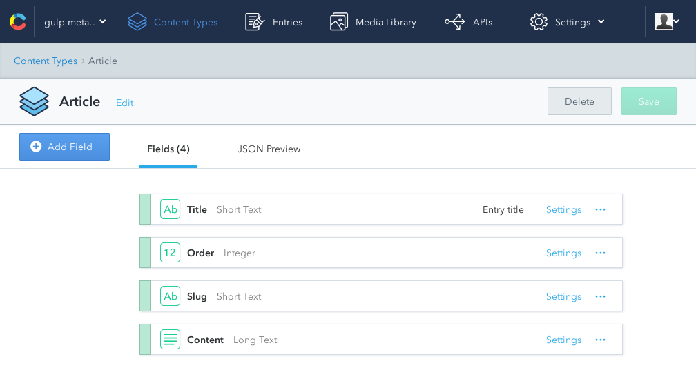
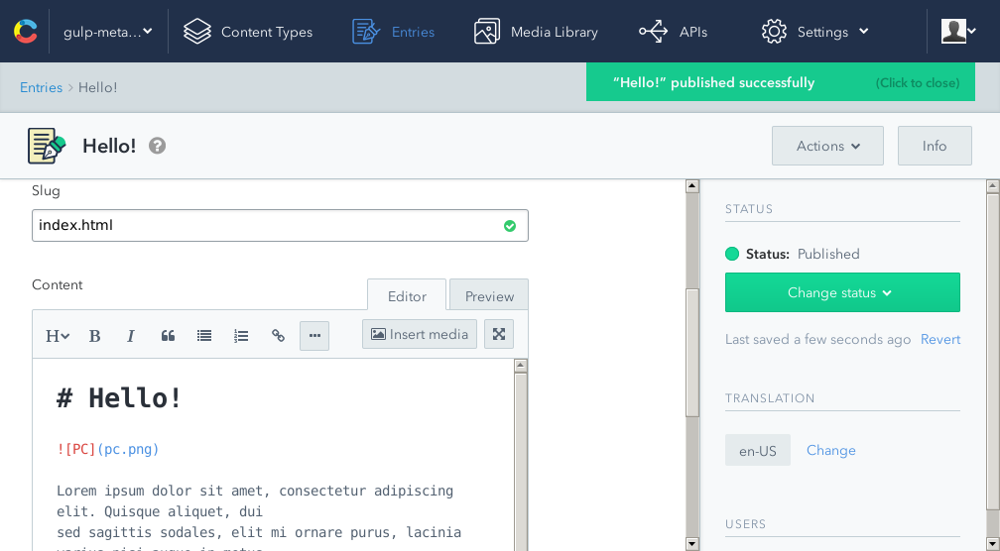

# Let me make a case for `gulp-metalsmith`

You are working as a web developer for Foo Solutions, a company that specializes
in highly available computing services. Unfortunately company's website is
backed by a popular PHP blogging platform. It takes on average 1650ms for the
page to load for the first time. And the last Friday it was hacked...


## Time to go static

A static website is just a bunch of assets like HTML/CSS/JS files, images,
videos/music and fonts. These are things that we can send to end-users very
efficiently. And there's no admin panel that can be hacked.

You've researched the topic and found out that [metalsmith][1] is a viable tool
for static site generation. Your copywriter prepared contents for the new
website, written down using [Markdown][2]. It's enough to code ([full
source][3]):

```js
Metalsmith(__dirname)
  .use(markdown())
  .use(layouts({engine: 'swig'}))
  .build(done);
```

It takes Markdown sources (like [index.md][4]), converts it to HTML and then
wraps it with specified layout. In the `build` directory we can find a set of
assets ready to be deployed.


## You're missing gulp... ;-(

You used [gulp][5] for in your previous projects and it feels like a waste of
time to move well-covered tasks like file watching, compiling styles or gzipping
an outcome of a build process.


## `gulp-metalsmith` comes to the rescue

`gulp-metalsmith` is a lightweight plugin for **gulp** that incorporates
Metalsmith builds into gulp pipelines. Our example above can be rewritten like
this ([full source][6]):

```js
gulp.task('metalsmith', ['clean'], function () {
  return gulp.src('src/**')
    .pipe(metalsmith({
      use: [
        markdown(),
        layouts({engine: 'swig'})
      ]
    }))
    .pipe(gulp.dest('build'));
});
```

The array defined in `use:` is a chain of Metalsmith plugins to pass your data
through. Using gulp's `src` and `build` methods we can define sourcing and a
final filesystem location. Now watching for file changes is as easy as that:

```js
gulp.task('watch', function () {
  gulp.watch('src/**', ['metalsmith']);
});
```


## Your copywriter is missing the old order

Every time your copywriter is going to supply you with new articles fot the 
website you have to patiently wait for an e-mail, move files to your working
tree, fix some issues with Markdown syntax and then redeploy assets.

Your copywriter also isn't the happiest person it the world. Instead of using
a nice, web-based editing application, files have to be edited by hand (what is
the source of aforementioned mistakes). Additionally there's no clear backup
strategy.


## Headless CMS

Headless Content Management Systems offer advanced editing interfaces and then
expose data via API. A variety of technology stacks can be used to utilize
content created by editors.

It's time to migrate articles to [Contentful][7]. You have to prepare Content
Type first (it's like a database table):



Now you can ask your content editor to use the app to work with articles;




## Closing the loop

Instead of using Markdown files stored locally you need to fetch articles from
Contentful and use it in your build. Official [Contentful client library for
JavaScript][8] will make this task really simple:

```js
gulp.task('contentful', function () {
  // Both space ID and access token can be found in the "APIs" section
  var client = contentful.createClient({
    space: '49ewbt9gbyem',
    accessToken: '4ffd55500ba0dbae29b4eefb033298f1e9f09df91d65cfb02eb480f5b33775c3'
  });

  client.getEntries({
    content_type: 'article',
    order: 'fields.order'
  }).then(function (entries) {
    var pages = preparePages(entries);
    fs.writeFileSync('src/pages.json', JSON.stringify(pages, null, 2));
  });
});
```

Please note that for larger applications you should use [Sync API][9].

The task above creates `src/pages.json` file:

```js
{
  "index.html": {
    "title": "Hello!",
    "order": 1,
    "layout": "basic.swig",
    "contents": "# Hello!\n\n\n\nLorem ipsum dolor sit amet, consectetur adipiscing elit. Quisque aliquet, dui\nsed sagittis sodales, elit mi ornare purus, lacinia varius nisi augue in metus.\n \n## Why Foo Solutions?\n\nAliquam erat volutpat. Suspendisse sagittis, justo at dictum laoreet, sapien\narcu semper eros, sit amet consectetur sem felis quis velit. Sed at lectus ut\naugue faucibus pellentesque non quis sem. \n"
  },
  "offer.html": {
    "title": "Offer",
    "order": 2,
    "layout": "basic.swig",
    "contents": "# Offer\n\nVivamus ut orci volutpat ante aliquet egestas at sit amet odio. Donec eget\negestas arcu. Integer in mi quis lectus porta sagittis.\n\n## What else?\n\nDonec fringilla libero non massa ornare, sed rutrum nunc iaculis. Aliquam\ntempor ullamcorper ex, eu faucibus lacus malesuada non.\n"
  },
  "contact.html": {
    "title": "Contact us",
    "order": 3,
    "layout": "basic.swig",
    "contents": "# Contact us\n\nInteger et risus imperdiet erat tincidunt hendrerit eu lacinia dui. Donec\nbibendum at eros non vestibulum. Cras cursus pellentesque massa, a volutpat\nfelis pharetra ut.\n\n## 24/7 helpline\n\nSuspendisse mattis condimentum congue. Fusce gravida felis ut arcu tristique\neleifend. Pellentesque convallis vel enim in venenatis."
  }
}
```

Files in this format can be consumed by `gulp-metalsmith`. We need to set two
options:

- `ignore` - we want to ignore Markdown files used previously (you can also
  delete these files)
- `json` - setting this option to `true` will make `gulp-metalsmith` to parse
  JSON files and create pages from its contents

```js
gulp.task('metalsmith-json', ['clean'], function () {
  return gulp.src('src/**')
    .pipe(metalsmith({
      ignore: 'src/*.md',
      json: true,
      use: [
        markdown(),
        layouts({engine: 'swig'})
      ]
    }))
    .pipe(gulp.dest('build'));
});
```


## The end

You ended up with a robust and maintainable development process. When you work
on layout or scripts, you run a file watcher with `gulp watch`. When your editor
prepared new articles in Contentful, you dump these to JSON file with
`gulp contentful`. If you're watching your `src/` directory, static pages will
be automatically regenerated.

[Here is the final gulpfile.js][6].


[1]: https://github.com/metalsmith/metalsmith
[2]: https://github.com/adam-p/markdown-here/wiki/Markdown-Cheatsheet
[3]: ./metalsmith-build.js
[4]: ./src/index.md
[5]: http://gulpjs.com/
[6]: ./gulpfile.js
[7]: https://www.contentful.com/
[8]: https://github.com/contentful/contentful.js
[9]: https://www.contentful.com/developers/docs/concepts/sync/
